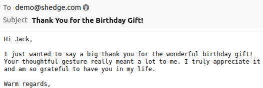

# OpenAI Chatbot with function calls




I've included for you in the section below, all the instructions required to run the project on your computer.

## 1. Run the API locally from sources

### First, 
let's duplicate the project github repository

```bash
>>> git clone https://github.com/Valkea/openai_chat_functions.git
>>> cd openai_chat_functions
```

### Secondly,
let's create a virtual environment and install the required Python libraries

(Linux or Mac)
```bash
>>> python3 -m venv venvOCF
>>> source venvOCF/bin/activate
>>> pip install -r requirements.txt
```

(Windows):
```bash
>>> py -m venv venvOCF
>>> .\venvOCF\Scripts\activate
>>> py -m pip install -r requirements.txt
```

### Thirdly,
let's define the environment variables
1. Create an `.env` file
2. Fill this file with the following content:
```
OPENAI_API_KEY = 'YOUR_KEY'
EMAIL_ADDRESS = 'YOUR_EMAIL'
EMAIL_PASSWORD = 'YOUR_PASSWORD'
EMAIL_SMTP = 'YOUR_EMAIL_SMTP'
EMAIL_PORT = 465
```
3. Replace the fake values with your own

### Running API server locally using Python scripts

Start the Inference Flask servers:
```bash
(venv) >> cd server
(venv) >> python app.py
```
Stop with CTRL+C *(once the tests are done, from another terminal...)*


### Tests

> One can check that the server is running by opening the following url:<br>
> http://0.0.0.0:5000/

> Then you can `post` a query to: <br>
> * http://0.0.0.0:5000/inference <br>
> and it will return a json encoded array of the predicted response.<br>
>
> Postman instructions:
> 1. create a POST query with one of the two previous URL,
> 2. add a field named 'query' of type File in Body/form-data),
> 3. add the query text,
> 4. send the request and get the result.

> You can also use the simple front-end:<br>
> 1. go to the `client` folder
> 2. open the `index.html`

At the moment this demo includes two tools:
- send an email to someone (it should ask for the email address and some indications for the content of the email)
- ask for the weather in some cities for Paris, Tokyo and San Francisco (this is a hardcoded function with fake temperatures)

## 2. Docker

No docker version at the moment.
